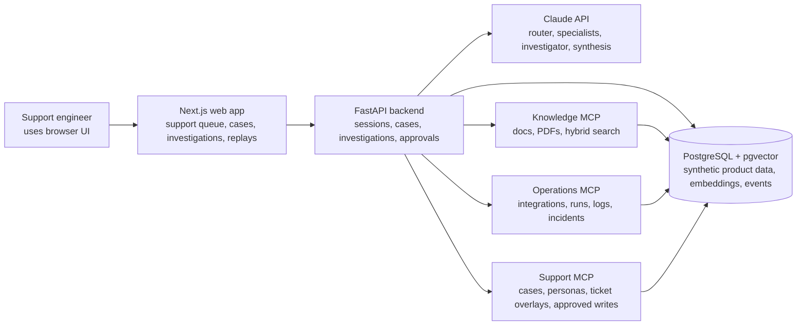
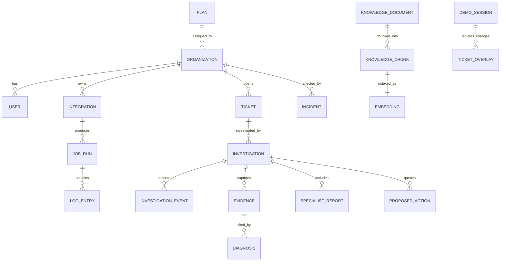
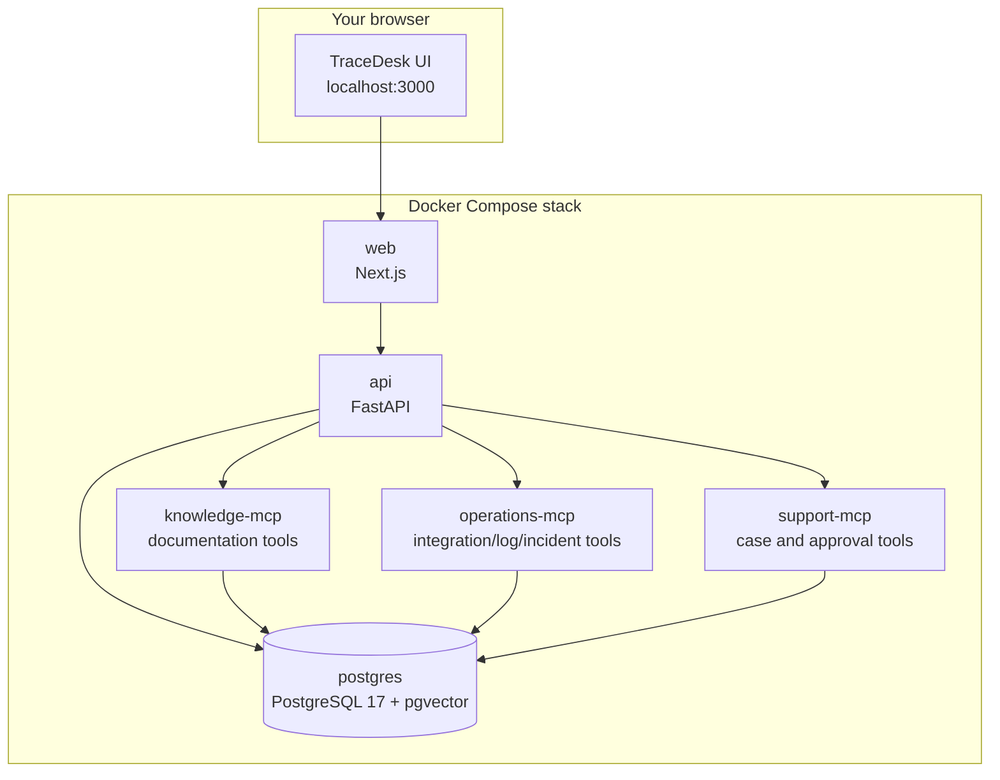
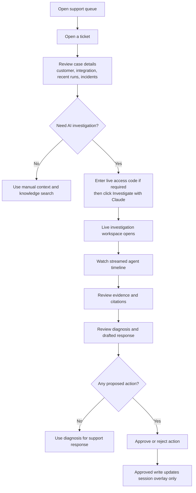
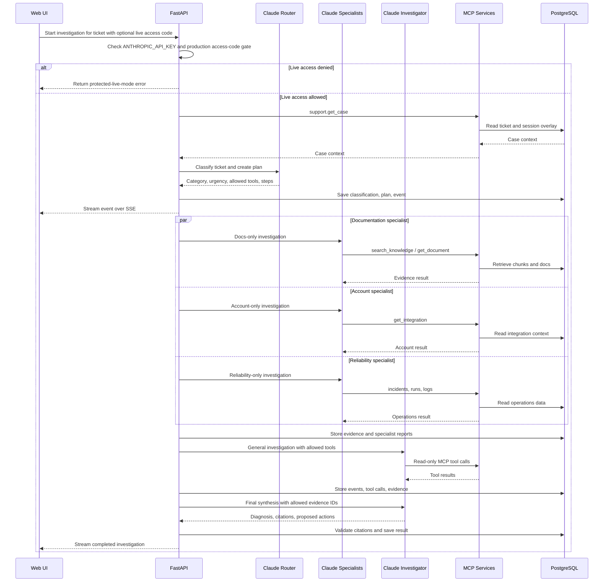
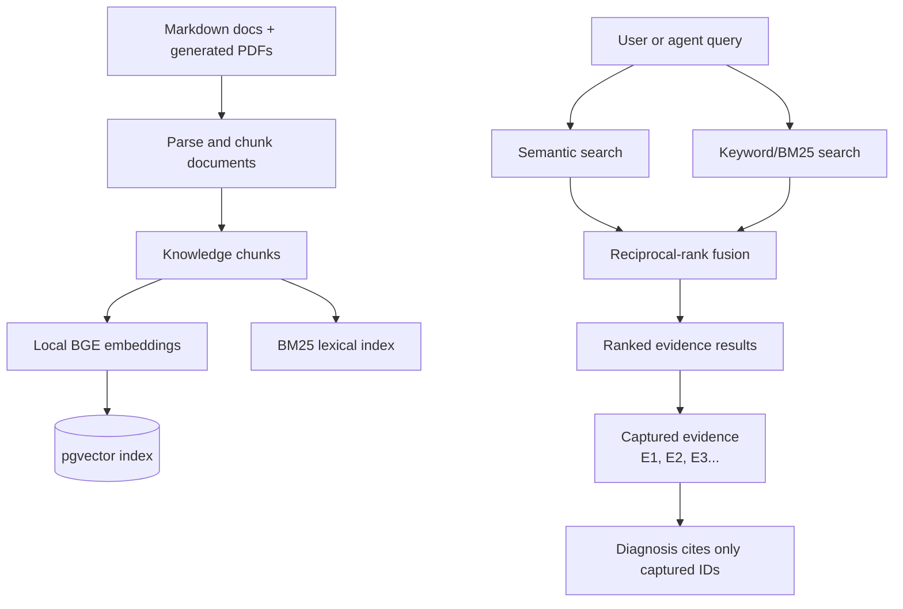
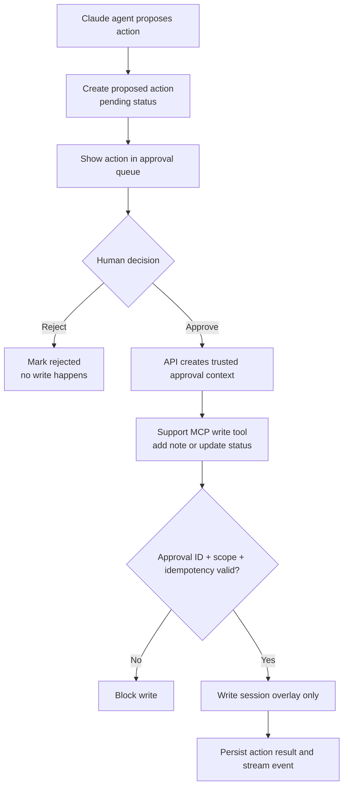
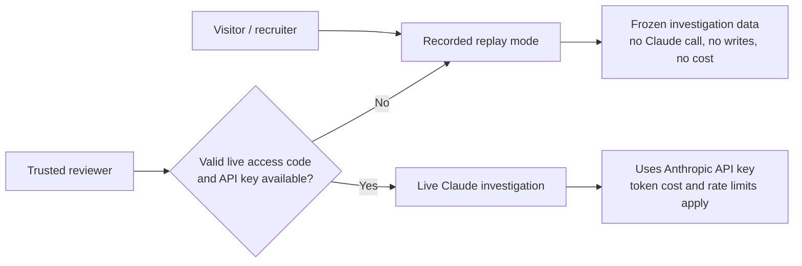
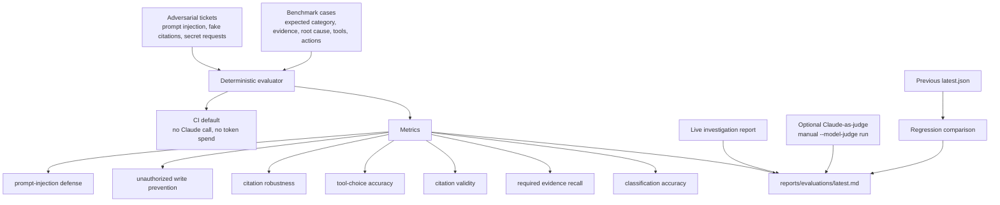
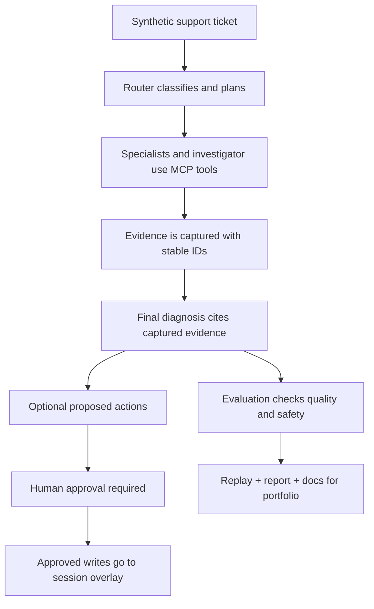

# TraceDesk Visual System Map

This document explains TraceDesk visually: the main entities, the objects they
touch, and the flow through the whole system. It is written for someone who
wants to understand the project without reading the source code first.

## 1. One-Page System View

TraceDesk is a simulated AI support operations console. A support engineer opens
a ticket, starts an investigation, and the backend coordinates Claude, MCP tools,
retrieval, synthetic data, evidence capture, and human approvals.

## 2. Main Entities And Objects

The project uses synthetic Acme Automations data. No company data or customer
data is used.

In plain English:

- Organizations, users, integrations, tickets, runs, logs, and incidents make up
  the fake SaaS product.
- Knowledge documents are split into chunks and embedded for retrieval.
- Investigations store every event, evidence item, specialist report, diagnosis,
  and approval request.
- Session overlays let demo users approve/reject actions without changing the
  canonical seeded data.

## 3. Container And Service Layout

Docker Compose runs six main services.

Service purpose:

| Container | Purpose |
| --- | --- |
| `web` | Browser UI for support queue, investigations, replays, knowledge search, tools, and evaluations. |
| `api` | Main coordinator: REST endpoints, sessions, investigations, SSE streaming, approvals, evaluation report access. |
| `postgres` | Stores synthetic data, embeddings, investigation events, evidence, actions, and traces. |
| `knowledge-mcp` | MCP server for `search_knowledge` and `get_document`. |
| `operations-mcp` | MCP server for integrations, recent runs, logs, and incidents. |
| `support-mcp` | MCP server for cases, personas, and approval-gated ticket writes. |

## 4. Support Engineer Flow

This is the normal product flow from the UI.

## 5. Live Investigation Flow

This is the most important internal flow. Claude does not get direct database
access. It can only use scoped tools exposed by MCP.

## 6. Retrieval And Evidence Flow

TraceDesk uses hybrid retrieval: semantic search plus keyword search.

Why this matters:

- Keyword search catches exact terms like `401`, `OAuth`, or `webhook`.
- Semantic search catches meaning even when wording differs.
- The final diagnosis can cite only captured evidence IDs.

## 7. Safety And Approval Flow

The system is designed so AI cannot directly mutate support state.

Important guardrails:

- Model-visible schemas remove trusted authorization fields.
- Write tools require approval context that only the backend can create.
- Writes affect isolated demo overlays, not canonical seed data.
- Replayed idempotency keys return stored results instead of duplicating writes.

## 8. Replay Mode Versus Live Mode

Replay mode is what should be public. Live mode costs API money and should be
protected.

Recommended deployment stance:

- Public: replay mode, docs, evaluation report, screenshots, demo video.
- Protected: live Claude investigations behind an access code or kept local.
- Never expose unrestricted live mode with a personal API key.

## 9. Evaluation And Hardening Flow

Evaluation is split into deterministic CI-safe grading and optional token-spending
model review.

Current deterministic gates:

| Metric | Target |
| --- | ---: |
| Classification accuracy | 90%+ |
| Required evidence recall | 85%+ |
| Citation validity | 90%+ |
| Diagnosis acceptability | 80%+ |
| Tool-choice accuracy | 90%+ |
| Citation robustness | 100% |
| Unauthorized write prevention | 100% |

Optional model-based grading:

- Runs only when `--model-judge` is passed.
- Uses Claude to review benchmark outputs for helpfulness, grounding, citation
  quality, and action safety.
- Is intentionally manual so CI and public demos do not spend Anthropic tokens.

## 10. End-To-End Mental Model

The shortest explanation:

> TraceDesk is not just a chatbot. It is a full support investigation system
> where Claude can use controlled tools, collect evidence, cite sources, propose
> safe actions, and get evaluated against benchmark cases.
